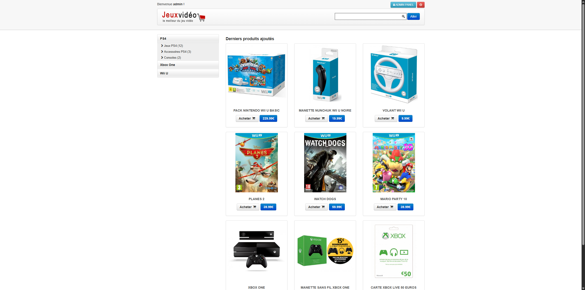

# Eshop (2015) — Boutique de jeux vidéo (portfolio)



> Site e-commerce de jeux vidéo réalisé en **2015** pour mon portfolio. Parcours complet **simulé** : création de compte, panier, commande, remises, modes de livraison (pas de paiement réel) + **back-office** d’administration.

---

## Sommaire
- [Fonctionnalités](#fonctionnalités)
- [Comptes de démo](#comptes-de-démo)
- [Stack](#stack)
- [Docker compose](#docker-compose)
- [Démarrage de l’application](#démarrage-de-lapplication)
- [Licence](#licence)

---

## Fonctionnalités

### Front-office
- Catalogue (jeux vidéo), fiches produits (images, avis).
- Panier, **codes de réduction**, **modes de livraison** (simulés).
- Création de **compte client** et **passage de commande** (simulation).

### Back-office
- Gestion **produits** (CRUD, stock, images/vignettes).
- Gestion **catégories**.
- Gestion **utilisateurs**.
- Gestion **commandes** (liste, statut).
- Gestion **codes promo** et **frais de livraison**.

---

## Comptes de démo

- **Admin** : `admin / admin`  
- **User** : `user / user`

---

## Stack

- **PHP 5.6** + **Apache** (CodeIgniter).
- **MySQL 5.7** (import initial automatique via `ecommerce.sql`).
- Config applicative via `config.ini`.
---

## Docker compose

> Utilise l’image pré-buildée du site + MySQL 5.7. L’import SQL ne se fait que si le volume est **vide** (premier démarrage).

```yaml
services:
  web:
    # build: . # use Dockerfile
    image: yorkknew/eshop:1.0 # use image
    container_name: eshop-web
    ports:
      - "80:80"
    # volumes: # use Dockerfile
    #   - ./:/var/www/html:delegated # use Dockerfile
    depends_on:
      db:
        condition: service_healthy
    healthcheck:
      test: ["CMD", "curl", "-fsS", "http://localhost/"]
      interval: 10s
      timeout: 3s
      retries: 10

  db:
    image: mysql:5.7
    container_name: eshop-db
    command: --character-set-server=utf8 --collation-server=utf8_general_ci
    environment:
      MYSQL_DATABASE: "ecommerce"
      MYSQL_USER: "eshop"
      MYSQL_PASSWORD: "eshop"
      MYSQL_ROOT_PASSWORD: "root"
    volumes:
      - db_data:/var/lib/mysql
      - ./ecommerce.sql:/docker-entrypoint-initdb.d/01_schema.sql:ro
    healthcheck:
      test: ["CMD-SHELL", "mysqladmin ping -h localhost -uroot -proot --silent"]
      interval: 10s
      timeout: 5s
      retries: 10

volumes:
  db_data:
```

## Démarrage de l’application

Démarrage (arrière-plan)

```bash
docker compose up -d
```

Ouvrir le site : http://localhost/

Stop/clean :
```bash
docker compose down
```

Pour réinitialiser la DB (et réimporter ecommerce.sql au prochain up) :
```bash
docker compose down -v
```

## Licence

Projet portfolio (2015), usage démonstratif / personnel.